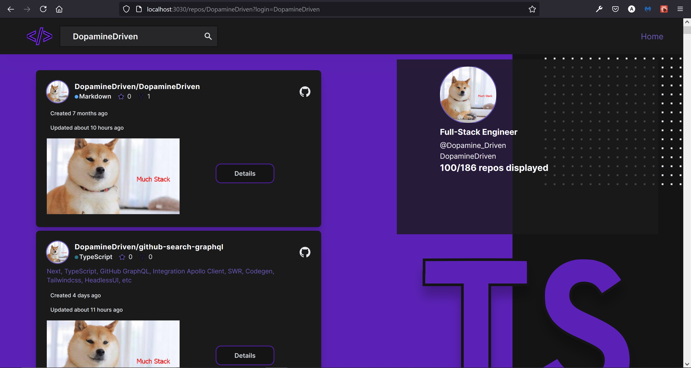
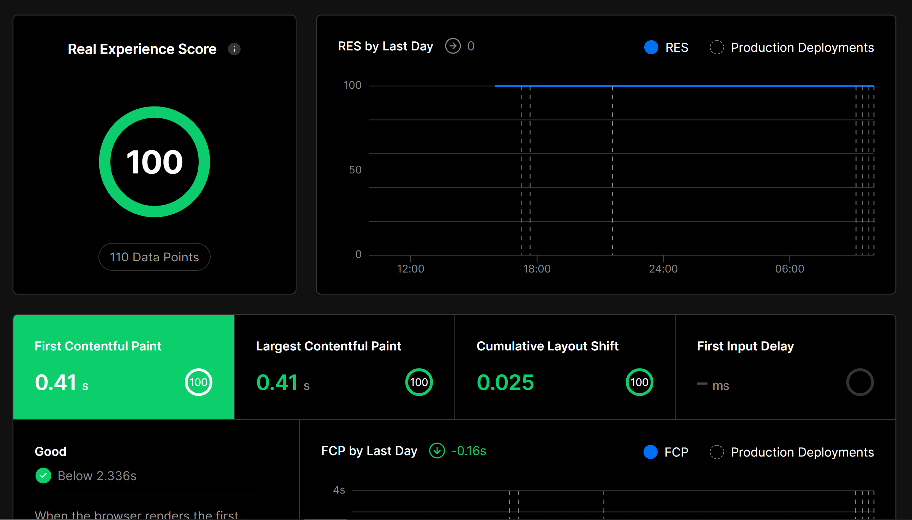

# github-search-graphql



### Getting Started

- Please see [`environmental-variables.md`](https://github.com/DopamineDriven/github-search-graphql/blob/main/environmental-variables.md)

### Running the program

- I use yarn so please do not use npm to install the dependencies unless you delete `yarn.lock` prior to installing. That said, after installing dependencies, add the environmental variables -- instructions can be found in the root `./environmental-variables.md` file. Then, run `yarn codegen`. After successfully generating typescript definitions from graphql fragments/queries/mutations, run `yarn dev`. That's it!

### tips

- make sure the username exists when searching from the landing page. I am using all serverside rendering for the search/details for any given user routes; conversely, I am using getStaticPaths and getStaticProps as a POC for my personal repos. It harnesses the power of ISR (incremental static regeneration). That said, it is probably ideal to use getServerSideProps over getStaticPaths/getStaticProps for an app of this nature due to the virtually infinite amount of data that can be fetched depending on user/org queried.



### Underway

- I have several bigger picture goals underway in this app including auth+mutations such as leaving comments and opening or closing issues. Another goal is pagination. Many of the components involved in the underway context can be found in components/Landing

### Housekeeping continued

- I will be fractionating large components (such as seen in pages/repos/[login]/[organization]) into smaller reusable components
- That said, I do have an agnostic repothread component found in `components/UI` that is used extensively throughout this repo. `ISSUES` is still actively under construction and not up to par for my standard at the moment. That said, pages/[login]/[details].tsx does provide a great issues details preview 👍

## Outlook

- Users vs Organizations
- Users have 20-character-Owner-Ids
- Organizations such as Vercel or Facebook have 28-to-32-character-Owner-Ids
- I figured that the id would provide differentiation for user account type. Interestingly, users remain consistent at 20 across several ids tested (mine, lee rob's, and tim neutken's). However, organization ID lengths varied +/-4 between 28 and 32 characters in length

###### ORG Users

- VERCEL: 32
  - "id": "MDEyOk9yZ2FuaXphdGlvbjE0OTg1MDIw",
- FACEBOOK: 28
  - "id": "MDEyOk9yZ2FuaXphdGlvbjY5NjMx",

###### Personal Users have 20 characters in ID

- LEE ROB: 20

  - "id": "MDQ6VXNlcjkxMTM3NDA=",

- ANDREW ROSS: 20

  - "id": "MDQ6VXNlcjQ2MzU1Nzk3"

- TIM NEUTKENS: 20

  - "id": " MDQ6VXNlcjYzMjQxOTk="

- ~~`plan A`~~

```tsx
<Link
	href={
		repo.node.owner.id.length > 20
			? '/repos/[login]/[organization]'
			: `/repos/[login]/[details]`
	}
	as={`/repos/${repo.node.nameWithOwner}`}
	passHref
	shallow={true}
	scroll={true}
>
	{/*...*/}
</Link>
```

- running `yarn dev`

```git
info  - Using external babel configuration from C:\Users\Anthr\cortina\github-search-graphql\.babelrc
event - compiled successfully
Error: You cannot use different slug names for the same dynamic path ('details' !== 'organization').
    at handleSlug (C:\Users\Anthr\cortina\github-search-graphql\node_modules\next\dist\next-server\lib\router\utils\sorted-routes.js:12:7)
    at UrlNode._insert (C:\Users\Anthr\cortina\github-search-graphql\node_modules\next\dist\next-server\lib\router\utils\sorted-routes.js:16:131)
    at UrlNode._insert (C:\Users\Anthr\cortina\github-search-graphql\node_modules\next\dist\next-server\lib\router\utils\sorted-routes.js:19:114)
    at UrlNode._insert (C:\Users\Anthr\cortina\github-search-graphql\node_modules\next\dist\next-server\lib\router\utils\sorted-routes.js:19:114)
    at UrlNode.insert (C:\Users\Anthr\cortina\github-search-graphql\node_modules\next\dist\next-server\lib\router\utils\sorted-routes.js:1:247)
    at C:\Users\Anthr\cortina\github-search-graphql\node_modules\next\dist\next-server\lib\router\utils\sorted-routes.js:30:40
    at Array.forEach (<anonymous>)
    at getSortedRoutes (C:\Users\Anthr\cortina\github-search-graphql\node_modules\next\dist\next-server\lib\router\utils\sorted-routes.js:30:17)
    at Watchpack.<anonymous> (C:\Users\Anthr\cortina\github-search-graphql\node_modules\next\dist\server\next-dev-server.js:14:46)
    at Watchpack.emit (node:events:365:28)
    at Watchpack._onTimeout (C:\Users\Anthr\cortina\github-search-graphql\node_modules\watchpack\lib\watchpack.js:331:8)
    at listOnTimeout (node:internal/timers:557:17)
    at processTimers (node:internal/timers:500:7)
error Command failed with exit code 1.
info Visit https://yarnpkg.com/en/docs/cli/run for documentation about this command.
```

- Plan A did not work, troubleshooting will continue with any updates posted accordingly

---

- GraphQL Graveyard

```graphql
fragment GitHubPageInfoPartial on PageInfo {
	startCursor
	endCursor
	hasNextPage
	hasPreviousPage
}

fragment GitHubLanguagePartial on Language {
	color
	id
	name
}

fragment GitHubRepoOwnerPartial on RepositoryOwner {
	avatarUrl(size: 12)
	id
	login
	url
}

fragment GitHubLanguagesPartial on LanguageConnection {
	totalSize
	totalCount
	pageInfo {
		...GitHubPageInfoPartial
	}
	edges {
		cursor
		size
		node {
			...GitHubLanguagePartial
		}
	}
}

fragment GitHubLicenseRulePartial on LicenseRule {
	key
	label
	description
}

fragment GitHubLicensePartial on License {
	id
	key
	nickname
	name
	spdxId
	pseudoLicense
	description
	url
	conditions {
		...GitHubLicenseRulePartial
	}
	limitations {
		...GitHubLicenseRulePartial
	}
	permissions {
		...GitHubLicenseRulePartial
	}
}

fragment GitHubRepositoryPartial on Repository {
	id
	name
	url
	shortDescriptionHTML
	descriptionHTML
	description
	createdAt
	updatedAt
	diskUsage
	homepageUrl
	stargazerCount
	forkCount
	openGraphImageUrl
	usesCustomOpenGraphImage
	isArchived
	isInOrganization
	watchers {
		totalCount
	}
	languages(orderBy: { field: SIZE, direction: DESC }) {
		...GitHubLanguagesPartial
	}
	licenseInfo {
		...GitHubLicensePartial
	}
	owner {
		...GitHubRepoOwnerPartial
	}
	primaryLanguage {
		...GitHubLanguagePartial
	}
}

fragment GitHubSearchResultItemConnectionPartial on SearchResultItemConnection {
	codeCount
	userCount
	issueCount
	repositoryCount
	pageInfo {
		...GitHubPageInfoPartial
	}
	edges {
		cursor
		node {
			...GitHubRepositoryPartial
		}
	}
}

query GitHubSearchRepos($query: String!, $first: Int!) {
	Search: search(
		first: $first
		query: $query
		type: REPOSITORY
	) {
		...GitHubSearchResultItemConnectionPartial
	}
}
```

`comment-fields.graphql`

```graphql
# import GitHubActorPartial from './actor-fields.graphql'
# import GitHubReactionConnectionPartial from './reaction-fields.graphql'
# import GitHubPageInfoPartial from './page-info-fields.graphql'

fragment GitHubDiscussionCommentPartial on GitHubDiscussionComment {
	id
	url
	isAnswer
	createdAt
	updatedAt
	upvoteCount
	body
	bodyHTML
	author {
		...GitHubActorPartial
	}
	reactions(first: 20) {
		...GitHubReactionConnectionPartial
	}
}

fragment GitHubDiscussionCommentsPartial on GitHubDiscussionCommentConnection {
	edges {
		cursor
		node {
			...GitHubDiscussionCommentPartial
		}
	}
	totalCount
	pageInfo {
		...GitHubPageInfoPartial
	}
}
```

`category-fields.graphql`

```graphql
fragment GitHubDiscussionsCategory on GitHubDiscussionCategory {
	id
	name
	emojiHTML
	emoji
	createdAt
	updatedAt
	isAnswerable
	description
}
```

`discussion-fields.graphql`

```graphql
# import GitHubActorPartial from './atomic/actor-fields.graphql'
# import GitHubDiscussionCommentsPartial from './atomic/comment-fields.graphql'
# import GitHubDiscussionCommentPartial from './atomic/comment-fields.graphql'
# import GitHubDiscussionsCategory from './atomic/category-fields.graphql'
# import GitHubReactionConnectionPartial from './atomic/reaction-fields.graphql'
# import GitHubPageInfoPartial from './atomic/page-info-fields.graphql'

fragment GitHubDiscussionPartial on GitHubDiscussion {
	id
	url
	number
	title
	upvoteCount
	createdAt
	includesCreatedEdit
	updatedAt
	body
	bodyHTML
	answer {
		...GitHubDiscussionCommentPartial
	}
	author {
		...GitHubActorPartial
	}
	category {
		...GitHubDiscussionsCategory
	}
	reactions(first: 20) {
		...GitHubReactionConnectionPartial
	}
	comments(first: 10) {
		...GitHubDiscussionCommentsPartial
	}
}

fragment GitHubDiscussionsPartial on GitHubDiscussionConnection {
	totalCount
	pageInfo {
		...GitHubPageInfoPartial
	}
	edges {
		cursor
		node {
			...GitHubDiscussionPartial
		}
	}
}
```
